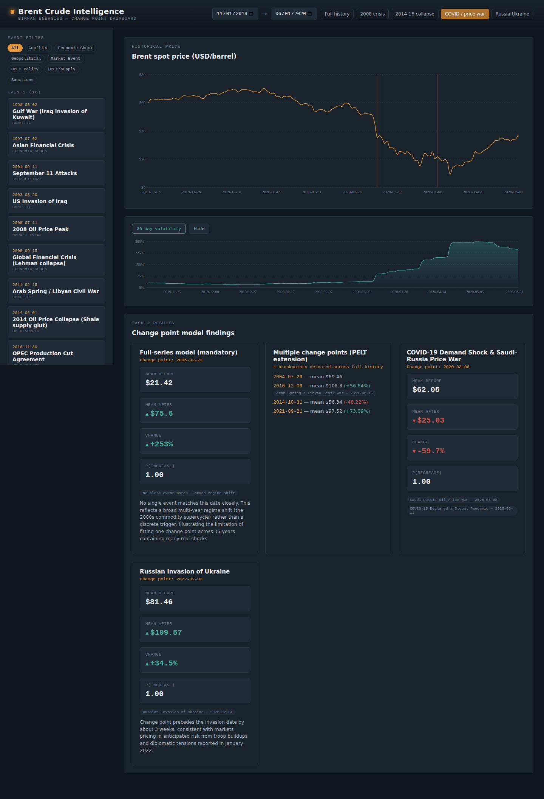

# Brent Oil Price Change Point Analysis

Change point analysis and statistical modeling of Brent crude oil prices,
associating detected structural breaks with major geopolitical, economic,
and OPEC-related events. Built for Birhan Energies (10 Academy KAIM Week 10
challenge).

## Project Structure

```
├── .vscode/
│   └── settings.json
├── .github/
│   └── workflows/
│       └── unittests.yml
├── .gitignore
├── requirements.txt
├── README.md
├── data/
│   ├── BrentOilPrices.csv        # raw daily Brent prices (1987-2022)
│   ├── brent_prices_cleaned.csv  # cleaned/parsed output of scripts/data_loader.py
│   └── key_events.csv            # researched major oil-market events
├── docs/
│   ├── analysis_workflow.md
│   ├── assumptions_and_limitations.md
│   ├── task2_findings.md
│   ├── Brent_Oil_Interim_Report.docx
│   └── screenshots/               # dashboard screenshots (Task 3)
├── src/
│   └── __init__.py
├── notebooks/
│   ├── __init__.py
│   ├── README.md
│   ├── eda.ipynb                  # Task 1 EDA
│   └── change_point_model.ipynb   # Task 2 Bayesian change point modeling
├── tests/
│   ├── __init__.py
│   └── test_data_loader.py
├── scripts/
│   ├── __init__.py
│   ├── README.md
│   └── data_loader.py
├── backend/                       # Task 3 — Flask API (see backend/README.md)
│   ├── app.py
│   ├── data_utils.py
│   ├── data/changepoint_results.json
│   └── routes/{prices,events,changepoints}.py
└── frontend/                      # Task 3 — React dashboard (see frontend/README.md)
    ├── src/
    └── package.json
```

## Setup

```bash
python -m venv venv
source venv/bin/activate        # Windows: venv\Scripts\activate
pip install -r requirements.txt
```

## Usage

Run the analysis notebooks:

```bash
jupyter notebook notebooks/eda.ipynb
jupyter notebook notebooks/change_point_model.ipynb
```

Run the dashboard (two terminals):

```bash
# Terminal 1 — backend
cd backend && python app.py

# Terminal 2 — frontend
cd frontend && npm install && npm run dev
```

Then open `http://localhost:5173`.

Run tests:

```bash
pytest tests/ -v
```

## Task Status

- [x] **Task 1** — Workflow definition, event data compilation, assumptions &
  limitations, initial EDA (`docs/`, `data/key_events.csv`, `notebooks/eda.ipynb`)
- [x] **Task 2** — Bayesian change point modeling with PyMC (full-series model
  + multiple-change-point extension + two focused case studies), quantified
  impact statements, event association (`notebooks/change_point_model.ipynb`,
  `docs/task2_findings.md`)
- [x] **Task 3** — Flask backend + React dashboard (`backend/`, `frontend/`,
  screenshots in `docs/screenshots/`)

## Dashboard Preview



## Key Caveat

This analysis identifies **statistical** change points in the price series
and proposes **plausible hypotheses** for what may have triggered them based
on timing and domain knowledge. It does not establish causation — see
`docs/assumptions_and_limitations.md` for a full discussion.
